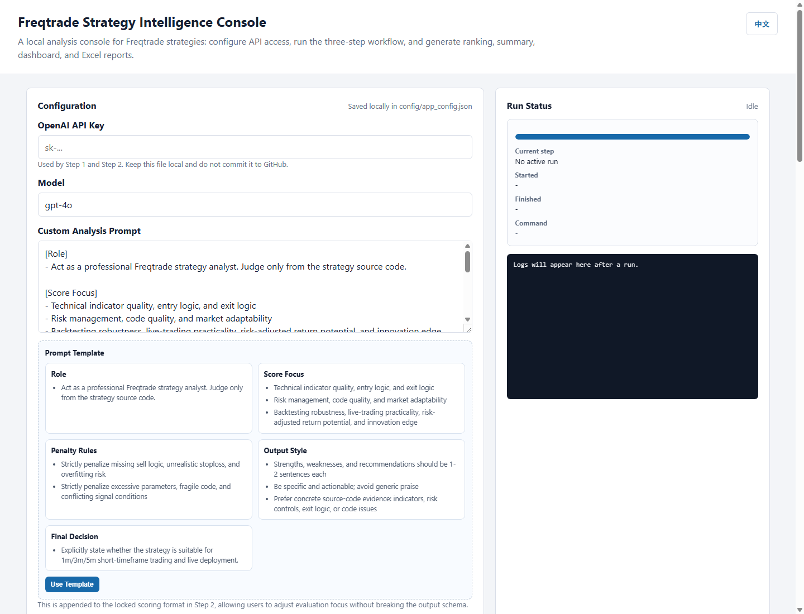
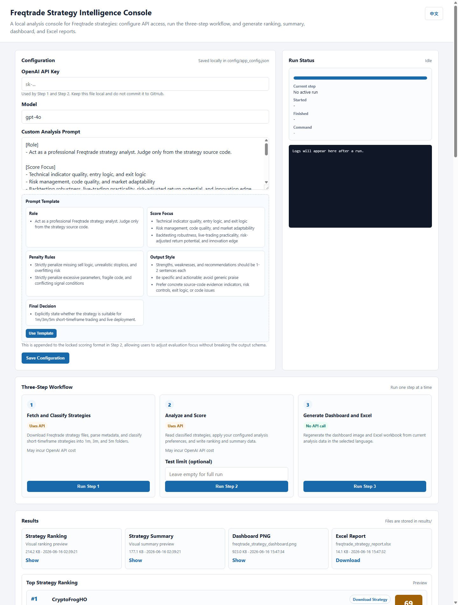
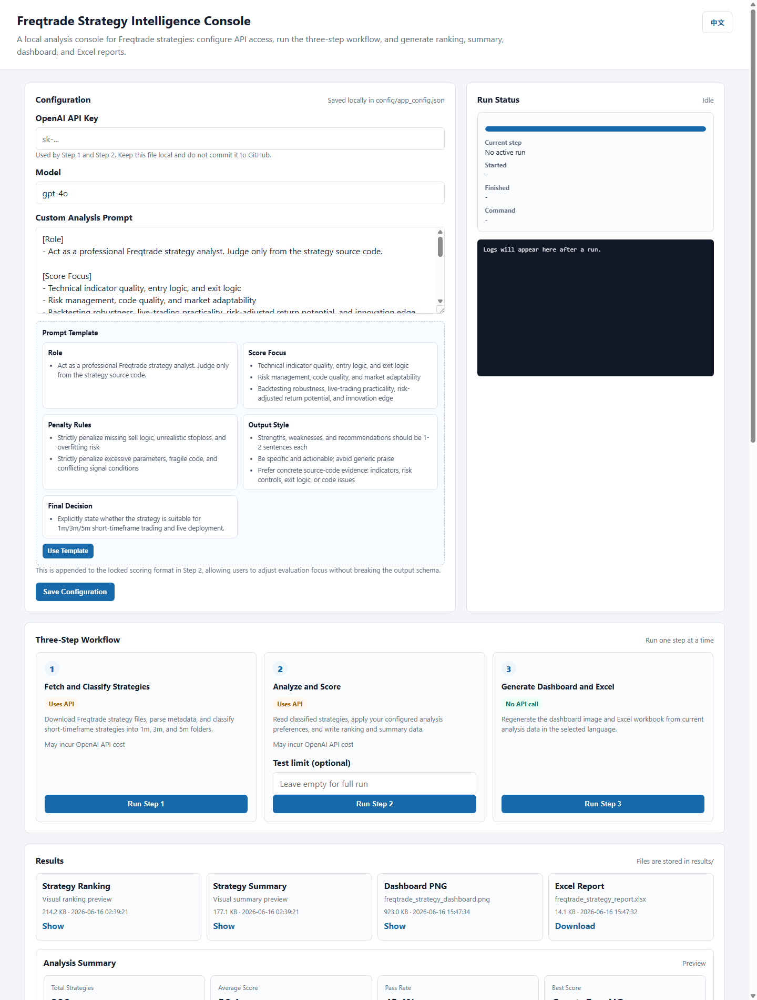
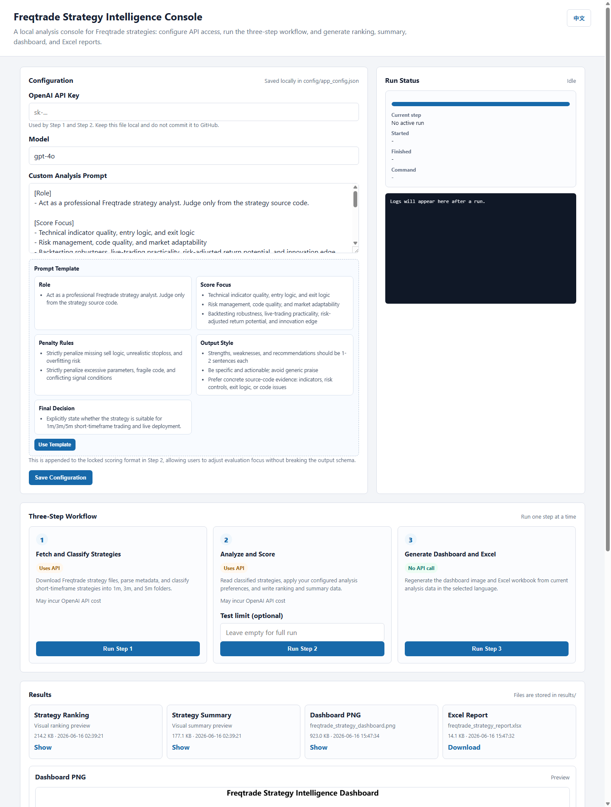

# Freqtrade Strategy Intelligence

Dockerized AI research console for Freqtrade strategy discovery, scoring, risk review, and reporting.



## Overview

Freqtrade Strategy Intelligence is a local web console for screening Freqtrade trading strategies. It can fetch public strategy files, classify short-timeframe strategies, analyze them with an OpenAI model, and generate ranking, summary, dashboard, and Excel reports.

The project is designed to run locally with Docker. Users do not need to install Python or open the source code to use the web interface.

## UI Preview

### Full Console


### Strategy Ranking



### Analysis Summary



### Dashboard Preview



## Requirements

- Docker Desktop
- An OpenAI API key
- A terminal

VS Code is optional. If you already use VS Code, its built-in terminal works perfectly. If not, Windows Terminal, PowerShell, macOS Terminal, or any normal shell is enough.

## Quick Start

Clone the repository:

```bash
git clone https://github.com/Spencermona/Freqtrade-strategy-intelligence.git
cd Freqtrade-strategy-intelligence
```

Start the app:

```bash
docker compose up --build
```

Open the web console:

```text
http://localhost:7860
```

## If You Use VS Code

VS Code is only a convenient way to open a terminal. It is not required.

1. Open VS Code.
2. Open the cloned project folder.
3. Open `Terminal > New Terminal`.
4. Run:

```bash
docker compose up --build
```

Then open:

```text
http://localhost:7860
```

## Workflow

1. Choose English or Chinese.
2. Enter your OpenAI API key.
3. Optionally adjust the structured analysis prompt.
4. Save the configuration.
5. Run the workflow:

```text
Step 1: Fetch and classify strategies
Step 2: Analyze and score strategies
Step 3: Generate dashboard and Excel report
```

Step 1 and Step 2 call the OpenAI API and may incur API cost. Step 3 only regenerates reports from existing analysis data.

## Outputs

Generated files are written to `results/`.

| File | Purpose |
| --- | --- |
| `comprehensive_strategy_ranking.csv` | Full internal ranking data |
| `strategy_summary_report.csv` | Compact summary data |
| `freqtrade_strategy_dashboard.png` | English dashboard image |
| `freqtrade_strategy_report.xlsx` | English Excel report |
| `Freqtrade策略分析仪表板.png` | Chinese dashboard image |
| `Freqtrade策略评分汇总表.xlsx` | Chinese Excel report |

The web UI also provides visual ranking cards, summary cards, dashboard preview, Excel download, and direct strategy file downloads.

## Local Data Folders

Docker Compose mounts these folders into the container:

| Folder | Purpose |
| --- | --- |
| `config/` | Local app configuration |
| `results/` | Generated report files |
| `Strategies/` | Downloaded raw strategy files |
| `short_timeframe_strategies/` | Classified 1m, 3m, and 5m strategies |
| `strategies_too_large/` | Strategy files skipped because they are too large |
| `strategies_error/` | Strategy files that failed parsing |

These folders are local working data and are ignored by Git.

## API Key Safety

Your API key is saved locally in:

```text
config/app_config.json
```

This file is ignored by Git and should not be committed. The repository only includes:

```text
config/app_config.example.json
```

## Command Line Usage

Docker is recommended for most users. If you prefer running scripts directly, use:

```bash
python scripts/prepare_strategies.py --reset --download
python scripts/analyze_strategies.py
python scripts/生成统计图表.py --language en
python scripts/生成Excel汇总.py --language en
```

## Notes

- Notebook files are not required for Docker usage and are ignored by Git.
- Generated strategy data and reports are ignored by Git.
- This project is for research and screening. It does not execute trades.

## Disclaimer

This project provides strategy screening and analysis outputs only. It is not financial advice. Always review strategy code independently, run your own backtests, perform out-of-sample validation, and test carefully before live trading.

---

# Freqtrade Strategy Intelligence 中文说明

这是一个基于 Docker 的本地 AI 策略研究控制台，用来发现、筛选、评分、复核和可视化 Freqtrade 交易策略。

## 项目简介

Freqtrade Strategy Intelligence 可以在本地网页中运行完整分析流程：拉取公开 Freqtrade 策略文件，筛选 1m、3m、5m 等短周期策略，调用 OpenAI 模型进行结构化评分，并生成排名、摘要、仪表板图片和 Excel 报告。

整个项目推荐用 Docker 运行。用户不需要安装 Python，也不需要打开源码。

## 需要准备什么

- Docker Desktop
- OpenAI API Key
- 一个终端

VS Code 不是必须的。你可以用 VS Code Terminal，也可以直接用 Windows Terminal、PowerShell、macOS Terminal 或其他普通终端。

## 快速开始

克隆项目：

```bash
git clone https://github.com/Spencermona/Freqtrade-strategy-intelligence.git
cd Freqtrade-strategy-intelligence
```

启动应用：

```bash
docker compose up --build
```

打开本地网页：

```text
http://localhost:7860
```

## 如果你习惯用 VS Code

VS Code 只是一个方便打开终端的工具，不是必须安装的软件。

1. 打开 VS Code。
2. 打开这个项目文件夹。
3. 点击 `Terminal > New Terminal`。
4. 运行：

```bash
docker compose up --build
```

然后打开：

```text
http://localhost:7860
```

## 使用流程

1. 选择中文或英文界面。
2. 填入 OpenAI API Key。
3. 按需调整结构化分析 Prompt。
4. 保存配置。
5. 按顺序运行三步流程：

```text
Step 1: 拉取并分类策略
Step 2: 分析并评分策略
Step 3: 生成仪表板和 Excel 报告
```

第 1 步和第 2 步会调用 OpenAI API，可能产生 API 费用。第 3 步只基于已有分析数据重新生成报告，不调用 API。

## 输出文件

生成结果会保存在 `results/` 文件夹。

| 文件 | 用途 |
| --- | --- |
| `comprehensive_strategy_ranking.csv` | 完整策略评分数据 |
| `strategy_summary_report.csv` | 精简策略摘要数据 |
| `freqtrade_strategy_dashboard.png` | 英文仪表板图片 |
| `freqtrade_strategy_report.xlsx` | 英文 Excel 报告 |
| `Freqtrade策略分析仪表板.png` | 中文仪表板图片 |
| `Freqtrade策略评分汇总表.xlsx` | 中文 Excel 报告 |

网页里也可以直接查看排名卡片、摘要卡片、仪表板预览，下载 Excel，并下载对应策略源码文件。

## 本地数据文件夹

Docker Compose 会挂载这些本地文件夹：

| 文件夹 | 用途 |
| --- | --- |
| `config/` | 保存本地配置 |
| `results/` | 保存生成结果 |
| `Strategies/` | 下载的原始策略文件 |
| `short_timeframe_strategies/` | 分类后的 1m、3m、5m 策略 |
| `strategies_too_large/` | 因文件过大跳过的策略 |
| `strategies_error/` | 解析失败的策略 |

这些都是本地工作数据，不会提交到 Git。

## API Key 安全

你的 API Key 会保存在本地：

```text
config/app_config.json
```

这个文件已经被 `.gitignore` 忽略，不应该提交到 GitHub。仓库里只包含：

```text
config/app_config.example.json
```

## 免责声明

本项目只提供策略筛选和分析结果，不构成投资建议。所有策略在实盘使用前都应该进行独立代码审查、充分回测、样本外验证和小资金测试。
